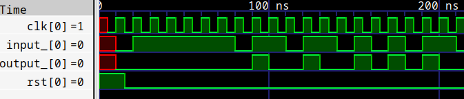

# 一、本地仿真环境搭建

## 1. 环境搭建

对于Verilog的仿真环境搭建，为了简便起见，这里推荐使用[Visual Studio Code（VSCode）](https://code.visualstudio.com/) + [Icarus Verilog (iverilog)](https://steveicarus.github.io/iverilog/#icarus-verilog) + [Gtkwave](https://gtkwave.sourceforge.net/)的仿真环境。

VScode用于编写代码，iverilog用于仿真，Gtkwave用于查看波形。

关于此仿真环境的搭建，网上的好教程很多，这里不再赘述。**这里推荐大家阅读[中科大数字电路实验1中3.1节](https://soc.ustc.edu.cn/Digital/history/2023/lab1/verilog_coding/)的教程，** 直至看到：

> "至此，我们已经得到了基本的 VSCode 开发环境。你可以阅读[这篇教程](https://zhuanlan.zhihu.com/p/636855738)获得更多的信息。"

当然你也可以继续完成3.2节的配置，来获取更好的编程体验，不过这并不是必须要做的。

## 2. 仿真示例

此处以一个101序列检测器作为示例：

### 创建`demo.v`:

```verilog
module demo(
        input clk,
        input rst,
        input wire a,
        output wire w
    );
    reg [2:0] buffer; //要检测的序列长度为3
    always @(posedge clk) begin
        if(rst) begin
            buffer <= 3'b0;
        end
        else begin
            buffer <= {buffer[1:0], a};
        end
    end
//检测101序列
assign w = (buffer == 3'b101);
endmodule
```

### 创建`demo_tb.v`，编写testbench:

```verilog
`timescale 1ns/1ns

module demo_tb();
    reg clk;
    reg rst;
    reg input_;
    wire output_;
	
    demo demo_dut(
             .clk(clk),
             .rst(rst),
             .a(input_),
             .w(output_)
         );

    //生成时钟
    initial begin
        #5
        clk = 1'b0; 
        forever #5 clk = ~clk;
    end
    
    //生成波形文件
    initial begin
        $dumpfile("wave.vcd");
        $dumpvars(0, demo_tb);
    end

    //生成输入测试信号
    initial begin
        forever #10 input_ = $random % 2;
    end

    //生成复位信号和设置仿真时长
    initial begin
        rst = 1;  //使能复位
        #15  rst = 0;
        #200 $stop;   //停止仿真
    end
    
endmodule
```

### 仿真

在vscode中`终端=>打开终端`，并输入命令：

```shell
iverilog -o simv demo.v demo_tb.v
vvp -n  simv -lxt2
```

如果你发现键入命令后报错：找不到iverlog，则需要检查`PATH`环境变量。

此时查看当前目录下文件，发现生成了`wave.vcd`波形文件，则可使用gtkwave打开文件：

```shell
gtkwave wave.vcd 
```



此处也可使用vscode的WaveTrace插件来打开vcd文件，但是该插件的免费版本最多只能显示8组信号。

**如果你不想每次仿真都输入好几条命令：** 可以尝试用`make`或者脚本来完成。
