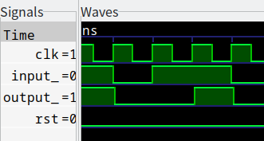

# 三、静态时序分析与门级仿真

<font color="#FF0000">注意：此部分内容在数字集成电路实验中有学到，但是写文档时还没有进行数集实验。数集实验中，老师给的模板更加完善。</font> 

## 1. 静态时序分析(STA)

静态时序分析用于验证同步时序的数字电路是否满足时序要求，比如说验证建立(setup)时间和保持(hold)时间是否满足要求，验证路径延迟是否满足要求等。

## 2. 门级仿真

在之前的仿真中，只是对电路的逻辑进行了仿真，但是没有考虑传播延迟等时序等方面的问题。而门级仿真是在逻辑门级别进行，考虑了延迟和时序的问题，可以更加精确的仿真数字电路。

## 3. 仿真示例

克隆仓库[https://github.com/EPTansuo/rtl_gate_sim_template](https://github.com/EPTansuo/rtl_gate_sim_template)到服务器。

如果你使用的是华工微电子学院服务器，直接执行下面的命令：

```shell
make gate_sim
```

即可进行对示例代码进行门极仿真,默认使用的是csmc 180nm的库。

如果你在其它环境中，则需要更改工艺库，见下一节。

打开`gate_sim/wave.vcd`，如果你可以看到输入和输出之间存在了延时，则门极仿真成功：



在`gate_sim/report/`文件夹下，有三个文件，分别STA的面积，功率和时序报告：

```
report
├── design.area
├── design.power
└── design.timing
```

在`gate_sim/`文件夹下有`demo.netlist.v`文件，这是综合生成的网表文件。

在`script/`文件夹有三个文件：

```
scripts
├── dc.tcl
├── gate_sim.mk
└── rtl_sim.mk
```

`dc.tcl`是Design Compiler的综合脚本。

`gate_sim.mk`是用于门极仿真的make构建文件。

`rtl_sim.mk`是用于逻辑仿真的make构建文件，如果要想进行RTL级别的仿真（逻辑仿真），可以使用`make rtl_sim`。

## 4. 更改工艺库

如果你使用的是虚拟机或其它环境，则需要更改库文件，如果你想用其它的库，也需要进行下面的操作：

编辑`Makefile`，替换成需要的文件:

```makefile
GATE_SIM_LIB_V = /SM01/foundry/csmc/bcd18/std_libs/CSMC018G3HD5VSBCD1P6Mlib_FB_V20F07/verilog/csmc018G3.v
```

编辑`scripts/dc.tcl`，替换成需要的文件：

```tcl
set STD_LIBS_PATH /SM01/foundry/csmc/bcd18/std_libs/CSMC018G3HD5VSBCD1P6Mlib_FB_V20F07
set LINK_LIBRARY [ list "${STD_LIBS_PATH}/synopsys/csmc018g3_typ.db"]
set TARGET_LIBRARY [ list  "${STD_LIBS_PATH}/synopsys/csmc018g3_typ.db" "${STD_LIBS_PATH}/synopsys/csmc018g3_max.db" ]
```

## 5. 将其应用到自己的工程

如果想要将该模板应用到自己的工程中，除了需要更改工艺库之外，还需要更改约束和顶层模块名：

修改`Makefile`，将`$(TOP)`改为顶层模块名，将`$(TB_NAME)`改为testbench模块名：

（这两个模块的名称应与文件名一致，否则可能会报错）

```makefile
TOP_NAME = demo
TB_NAME = demo_tb
```

修改`script/dc.tcl`:

将`$TOP_NAME`改为自己的顶层模块名：

```tcl
set TOP_NAME "demo"
```

将约束修改为自己所需要的条件：

```tcl
set MAX_AREA 100
set MAX_FINOUT 8
set MAX_TRANSITION 5
create_clock -name "clk" -period 10 -waveform { 5 10 } [get_ports clk_port]
```

除此之外，还可以在`script/dc.tcl`中修改其它内容。
